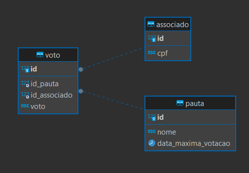

## Projeto de Avaliação de Pautas em Assembleia

### Requisitos Iniciais

Para rodar este projeto, é necessário ter instalado:

- **JDK 17**: Utilizei a OpenJDK, que pode ser baixada [aqui](https://download.java.net/java/GA/jdk17.0.2/dfd4a8d0985749f896bed50d7138ee7f/8/GPL/openjdk-17.0.2_windows-x64_bin.zip).
- **MySQL 8.0**: Banco de dados relacional para persistência dos dados.

### Configurações Iniciais

1. **Banco de Dados**:
    - Ajuste o arquivo `application.properties` para apontar para o seu banco de dados MySQL.
    - Configure usuário e senha conforme necessário.
    - No MySQL, crie um banco de dados chamado `avaliacao`.

2. **Ferramentas Utilizadas**:
    - Spring Boot: Framework para construção de aplicativos Java baseados em Spring.
    - Hibernate: Mapeamento objeto-relacional para persistência de dados.
    - Liquibase: Ferramenta de migração de banco de dados para controle e versionamento.
    - JUnit: Framework para testes unitários em Java.

### Intenção da Aplicação

O objetivo deste projeto é ser escalável e performático, especialmente para tratar cenários de concorrência de votos em grandes quantidades. A abordagem adotada garante que cada associado tenha seu voto registrado por pauta, evitando duplicidade e garantindo a integridade na contagem futura.

### Estrutura do Projeto

A aplicação foi estruturada em pacotes:

- `config`: Configuração da aplicação e componentes.
- `controller`: Classes que definem os endpoints da API.
- `exception`: Classes de exceção customizadas utilizadas no projeto.
- `model`: DTOs e entidades mapeadas do projeto.
- `repository`: Classes com acesso ao banco de dados.
- `service`: Regras de negócio da aplicação.

### Versionamento da API

Os endpoints estão versionados no padrão `/api/v1/`. Para adicionar uma nova versão da API, é possível criar uma classe usando `/v2`, mantendo assim compatibilidade com versões anteriores.

### Endpoints da API

#### Endpoint `/api/v1/pauta/criar-pauta`

Cria uma nova pauta.

- **Entrada**:
  ```json
  {
      "nome": "Nome da Pauta"
  }
  ```
- **Saída**:
  ```json
  {
      "id": 1,
      "nome": "Nome da Pauta"
  }
  ```

#### Endpoint `/api/v1/pauta/abrir-pauta`

Abre uma pauta para votação.

- **Entrada**:
  ```json
  {
      "tempo": 10,   // Tempo em minutos (opcional, padrão: 1)
      "idPauta": 1
  }
  ```
- **Saída**: Não possui.

- **Possíveis Exceções**:
    - `PautaNaoExistenteException`: Caso o ID da pauta não exista.
    - `PautaJaIniciadaException`: Caso a pauta já tenha sido iniciada para votação.

#### Endpoint `/api/v1/pauta/votar`

Registra o voto de um associado em uma pauta.

- **Entrada**:
  ```json
  {
      "idPauta": 1,
      "idAssociado": 1,
      "voto": "SIM" | "NAO"
  }
  ```
- **Saída**: Não possui.

- **Possíveis Exceções**:
    - `IllegalArgumentException`: Caso o associado não exista na base de dados.
    - `VotoRealizadoException`: Caso o associado já tenha votado nesta pauta.
    - `PautaFinalizadaException`: Caso a pauta não esteja aberta para votação ou o tempo dela tenha esgotado.

#### Endpoint `/api/v1/pauta/contabilizar-pauta/{idPauta}`

Realiza a contabilização dos votos de uma pauta específica.

- **Entrada**: Via PATH `{idPauta: Long}`
- **Saída**:
  ```json
  {
      "id": 1,
      "nome": "Nome da Pauta",
      "votosSim": 10,
      "votosNao": 5
  }
  ```

### Observações

- O método que realiza a validação do CPF está comentado pois a aplicação no Heroku não estava respondendo de maneira correta, fiz testes via postman e navegador e em todos os cenários estava retornando 404, sendo assim comentei a chamada da mesma para que a aplicação funcione.
  Para complementar o README com a modelagem do banco de dados, você pode adicionar uma seção que descreva a estrutura das tabelas criadas pelo Liquibase. Baseado na sua descrição, aqui está um exemplo de como você poderia detalhar essa parte:

---

### Modelagem do Banco de Dados

A estrutura do banco de dados foi criada utilizando Liquibase para migração automática. Abaixo está a modelagem das tabelas principais:



#### Tabelas Principais

1. **associado**:
    - Tabela que armazena informações dos associados que podem votar nas pautas da assembleia.

2. **voto**:
    - Tabela que registra os votos dos associados em cada pauta.

3. **pauta**:
    - Tabela que armazena informações sobre as pautas discutidas em assembleias.

#### Outras Tabelas

Além das tabelas principais, o Liquibase cria outras tabelas para controle interno, como tabelas de histórico de alterações (`databasechangelog`, `databasechangeloglock`).

#### Carga Inicial Para Testes

Para realizar os testes iniciais, é necessário criar registros na tabela `associado` para vincular os CPFs aos usuários. Abaixo estão os comandos SQL para inserção dos dados:

```sql
INSERT INTO associado (cpf) VALUES
('12345678909'),
('23456789012'),
('34567890123'),
('45678901234'),
('56789012345'),
('67890123456'),
('78901234567'),
('89012345678'),
('90123456789'),
('01234567890');
```

**Observação:** Caso ocorra algum problema com a execução do Liquibase, você pode usar o arquivo "base.txt" que contém os scripts para criação da base de dados.